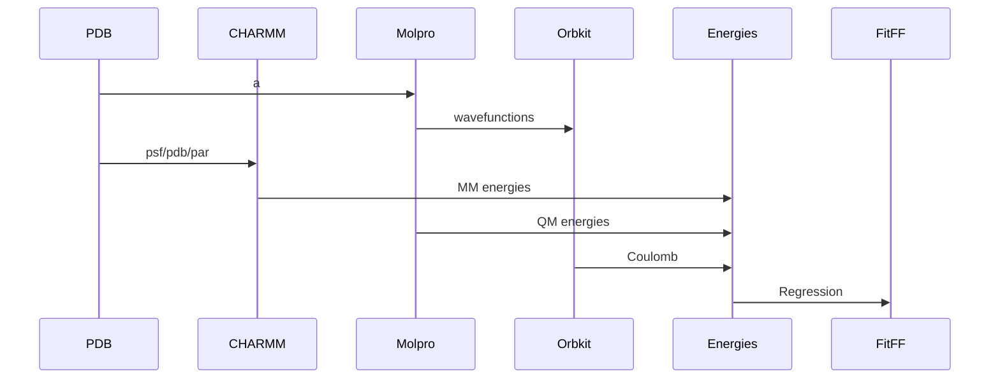

# FF-Energy
A package for calculating the energy of a system of particles using a force field.

## Design




## Installation

```bash
pip install -e .
```

## Usage
Make CHARMM jobs to calculate energies:
```bash
python ff_energy/ffe/cli.py  -m water_cluster -t pbe0dz -e tip3 -chmj
```

Make Molpro jobs to calculate energies:
```bash
python ff_energy/ffe/cli.py -m water_tests -t pbe0dz -e tip3 -mj -s
```

ESP View:
```bash
python ff_energy/ffe/cli.py -m water_tests -t pbe0dz -e tip3 -esp
```


Gather data:
```bash
python ff_energy/ffe/cli.py -d -m water_cluster -t pbe0dz -e tip3
```


## Contributing
Eric D. Boittier
