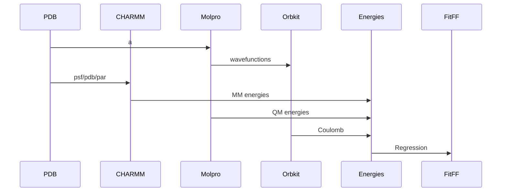

# FF-Energy
A package for calculating the energy of a system of particles using a force field.

## Installation

### Requirements
Installation using conda is recommended.  The following packages are required:
```bash
conda env create --file environment.yml

conda install -c conda-forge povray
```

### Simple (Python Only)
```bash
pip install -e .
```

## A "minimal" example for setting up the force field fitting

```python

import numpy as np
from tqdm import tqdm
import matplotlib.pyplot as plt
import pandas as pd
from ff_energy.ffe.slurm import SlurmJobHandler
from pathlib import Path
import pandas as pd
import jax.numpy as jnp
import itertools as it
import matplotlib.pyplot as plt
import seaborn as sns
import numpy as np
from ff_energy.ffe.potential import (
    LJ,
    DE,
)
from ff_energy.ffe.ff import FF
from ff_energy.ffe.constants import FFEPATH, PDB_PATH
from ff_energy.plotting.ffe_plots import plot_energy_MSE, plot_ff_fit
from ff_energy.plotting.plotting import set_style
from ff_energy.plotting.fit_results import residuals_plot, residuals_from_keys
from ff_energy.logs.logging import hide_logs
from ff_energy.ffe.potential import LJ, LJ_bound, DE

hide_logs()
import scienceplots
set_style(no_latex=True)

from ff_energy.ffe.ff_fit import (
    load_ff,
    fit_func,
    fit_repeat,
)

from ff_energy.utils.ffe_utils import pickle_output, read_from_pickle, str2int, PKL_PATH
from ff_energy.utils.json_utils import load_json
from ff_energy.ffe.structure import atom_key_pairs

from ff_energy.utils.ffe_utils import pickle_output, read_from_pickle, str2int, \
    PKL_PATH, get_structures

from sklearn.metrics import mean_squared_error as calc_rmse
"""
Load the structures
- note the formatting of the pdb files, they should be compatible with CHARMM's format
- atom types are hard coded in FF-Fit/ff_energy/ffe/constants.py and FF-Fit/ff_energy/ffe/configmaker.py so they may need to be adapted 
""" 
structure = "waternn"
structs, _ = get_structures(structure, # string, also name of the pdb directory
                            pdbpath= Path('/cluster/home/boittier/pycharmm/') / structure # path to a directory containing pdbs
                           )
# set the two body distances
for s in structs:
    s.set_2body()
# make the key for the distances, the same as the key in the dataframe
dists = {str(s.name)[:-4].lower(): s.distances for s in structs}
struct_data = structs[0] # example for connectivity and atom types
sig_bound = (0.0025, 5.5)
ep_bound = (0.001, 1.0)
FUNC = LJ
BOUNDS = LJ_bound
elec = "ele"
target = "intE"

data_ = df.copy()
data_.index = [f"waternn{_}" for _ in df.index]
data_ = data_.iloc[[ i for i, _ in enumerate(data_.index) if _ in set(dists.keys())]]

# e.g. check that no data is missing and keys match
assert set(dists.keys()).difference( set(data_.index)) == set()
assert set(data_.index).difference(set(dists.keys())  ) == set()

# create the FF object
ljpcff = FF(
    data_, # pd.DataFrame
    dists, # dictionary of distances
    LJ, # function name
    [(0, 1) for _ in range(4)], # tuple for bounds, N x 2 where N = num. of parameters
    struct_data, # structure data
    elec=elec, # name of elec. energy in dataframe
    intE=target, # name of interaction energy in dataframe
)
#  set the target quantities to fit to
ljpcff.num_segments = len(data_) # number of structures used in fit
print("Nsegments", ljpcff.num_segments) 
ljpcff.set_targets() # set the vdw energy as the interaction energy - electrostatics

ljpcff_fit = fit_repeat(
              ljpcff, # force field object
             1000, # number of repeats
             "JOBNAME", # job name
             loss="jax",
            bounds=[(0.2245*0.75, 0.2245*1.25), (1.7682*0.75, 1.7682*1.25),
                                    (0.046*0.5, 0.046*1.5), (0.1521*0.5, 0.1521*1.5)], # tuple for bounds, N x 2 where N = num. of parameters
            quiet=True) # i.e. not verbose

# make a new column in the data frame from the best parameters.
ljpcff.data["pred"] = ljpcff.eval_jax(ljpcff_fit.get_best_parm())[0]
ljpcff_fit.data["pred"] = ljpcff_fit.eval_jax(ljpcff_fit.get_best_parm())[0]
                                                H-sig,   O-sig    H-rmin/2   O-rmin/2
# ljpcff_fit.data["pred"] = ljpcff_fit.eval_jax([0.0230,  1.7653, -0.2470, -0.2275])[0]
# OT     0.00  -0.2275  1.7653 ! ALLOW WAT
# HT     0.00  -0.2470  0.0230 ! ALLOW WAT BO7

```


### PyCHARMM (Energy Evaluations and MD in CHARMM)
The python interface for the Havard Molecular Mechanics (CHARMM) program is required for the CHARMM energy calculations.  The PyCHARMM package is not available on PyPI and must be installed manually.

Instructions, from Dr. Kai Toepfer, are included in the [pycharmm_runner](README.md) directory.

## Usage
### Using the FFE tools
Make CHARMM* jobs to calculate energies:
```bash
python ff_energy/ffe/cli.py  -m water_cluster -t pbe0dz -e tip3 -chmj
```
[*uses the CHARMM executable to calculate energies]

Make Molpro jobs to calculate energies:
```bash
python ff_energy/ffe/cli.py -m water_tests -t pbe0dz -e tip3 -mj -s
```

Make Orbkit jobs to calculate the Coulomb integrals:
```bash

 python ff_energy/ffe/cli.py -m ions -t pbe0dz -e tip3 -cj -s -msp  /home/boittier/pcnccr
```

ESP View:
```bash
python ff_energy/ffe/cli.py -m water_tests -t pbe0dz -e tip3 -esp
```


Gather data:
```bash
python ff_energy/ffe/cli.py -d -m water_cluster -t pbe0dz -e tip3
```

### Sampling
#### MD (CHARMM)
Choose residues based on name, extract residue and nearest neighbours from
the trajectory:
```bash
python MD_sampling.py -v -dl /home/boittier/pcbach/charmmions/step5_1.dcd /home/boittier/pcbach/charmmions/step5_2.dcd /home/boittier/pcbach/charmmions/step5_3.dcd /home/boittier/pcbach/charmmions/step5_4.dcd -p /home/boittier/pcbach/charmmions/step3_pbcsetup.psf -r POT -n 35
```


### PyDCM
Scripts available, CLI in development.


## Design



## Contributing
Eric D. Boittier
