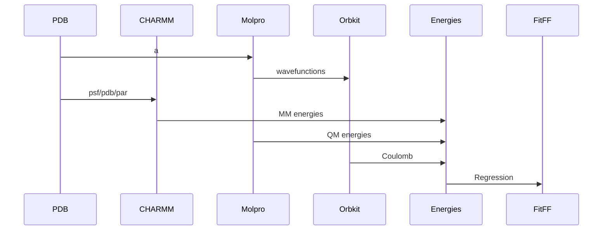

# FF-Energy
A package for calculating the energy of a system of particles using a force field.

## Design




## Installation

### Simple (Python Only)
```bash
pip install -e .
```

### PyCHARMM (Energy Evaluations and MD in CHARMM)
The python interface for the Havard Molecular Mechanics (CHARMM) program is required for the CHARMM energy calculations.  The PyCHARMM package is not available on PyPI and must be installed manually.

Instructions, from Dr. Kai Toepfer, are included in the [pycharmm_runner](README.md) directory.

## Usage
### Using the FFE tools
Make CHARMM* jobs to calculate energies:
```bash
python ff_energy/ffe/cli.py  -m water_cluster -t pbe0dz -e tip3 -chmj
```
[*uses the CHARMM executable to calculate energies]

Make Molpro jobs to calculate energies:
```bash
python ff_energy/ffe/cli.py -m water_tests -t pbe0dz -e tip3 -mj -s
```

Make Orbkit jobs to calculate the Coulomb integrals:
```bash

 python ff_energy/ffe/cli.py -m ions -t pbe0dz -e tip3 -cj -s -msp  /home/boittier/pcnccr
```

ESP View:
```bash
python ff_energy/ffe/cli.py -m water_tests -t pbe0dz -e tip3 -esp
```


Gather data:
```bash
python ff_energy/ffe/cli.py -d -m water_cluster -t pbe0dz -e tip3
```

### Sampling
#### MD (CHARMM)
Choose residues based on name, extract residue and nearest neighbours from
the trajectory:
```bash
python MD_sampling.py -v -dl /home/boittier/pcbach/charmmions/step5_1.dcd /home/boittier/pcbach/charmmions/step5_2.dcd /home/boittier/pcbach/charmmions/step5_3.dcd /home/boittier/pcbach/charmmions/step5_4.dcd -p /home/boittier/pcbach/charmmions/step3_pbcsetup.psf -r POT -n 35
```


### PyDCM
Scripts available, CLI in development.

## Contributing
Eric D. Boittier
